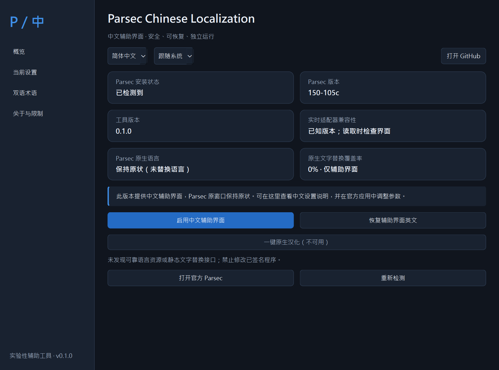
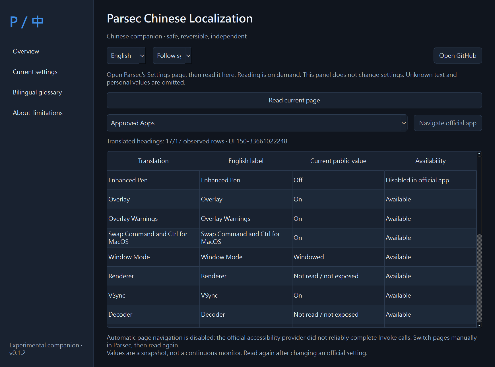
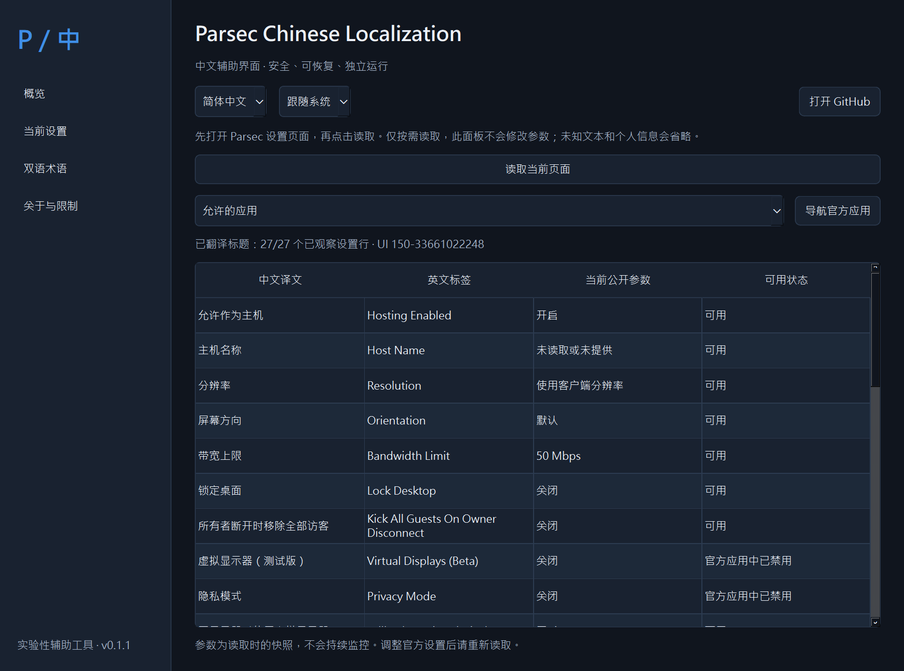
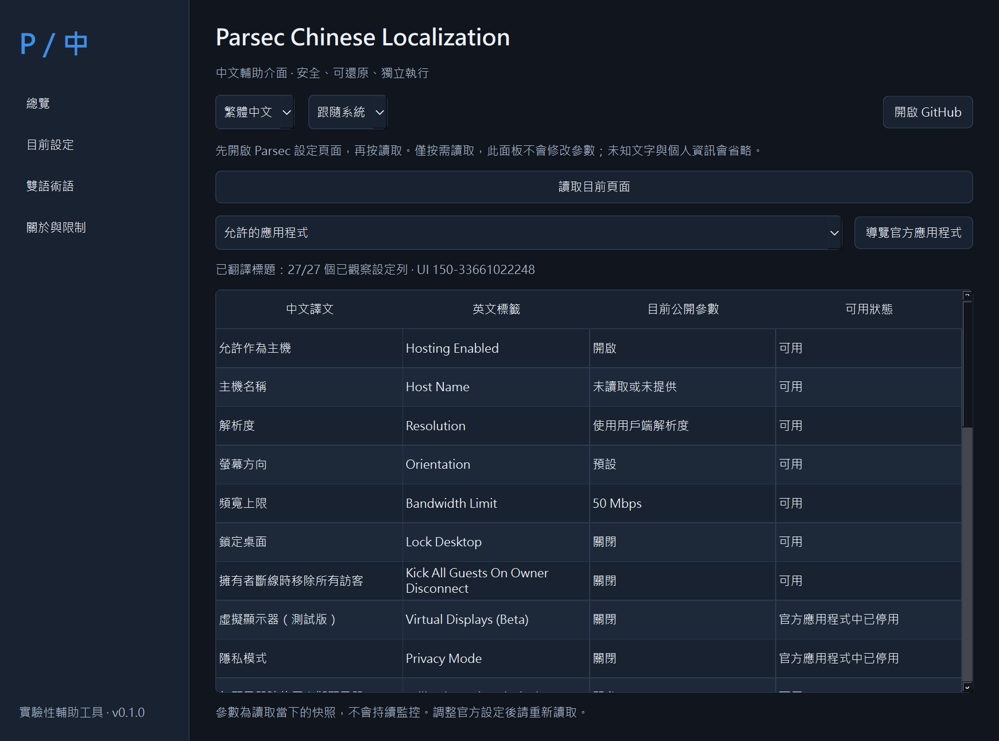

# Parsec Chinese Localization

**实验性中文辅助工具，尚不能替换 Parsec 原生界面文字。原生汉化覆盖率：0%。**

本项目为 Parsec Remote Desktop（[parsec.app](https://parsec.app)）提供简体、繁体中文辅助窗口。当前官方客户端没有经过验证的语言包接口；修改签名 DLL 不符合本项目的安全要求。详细证据见 [可行性调查](docs/FEASIBILITY.md)。不隶属于 Parsec 官方，也不代表获得官方认可。

## 功能

- 图形界面、简体／繁体／英文、深浅色与系统主题、系统中文字体。
- 自动检测安装位置、版本与 Windows 签名；不申请管理员权限。
- 160 条双语术语，支持搜索，保留专业参数和快捷键。
- 在已验证的 Windows 版本中，按需读取官方当前设置页的标题和公开参数，在中文面板中显示。
- 通过明确的导航按钮进入官方页面；实际参数调整仍在官方应用中完成。
- 工具偏好设置自动备份、原子写入、重复切换幂等；可恢复工具英文、清理及卸载。
- 点击时才检查 GitHub 发布版本；日志只含固定事件名称。

「一键原生汉化」按钮禁用且显示原因。启用中文只改变辅助窗口，不会显示 Parsec 已汉化的虚假成功状态。

## 平台与兼容性

| 平台 | 辅助界面与术语 | 实时设置读取 |
| --- | --- | --- |
| Windows 10/11 x64 | 提供安装器与便携版；本机 Windows 11 已验证 | 仅签名有效的 APP `150-105c`、UI `150-33661022248` |
| macOS Apple Silicon | CI 构建 DMG；运行验证状态见验证记录 | 未实现，禁用 |
| macOS Intel | CI 构建 DMG；运行验证状态见验证记录 | 未实现，禁用 |

macOS Qt 6.12 的最低系统要求以依赖包为准；不宣称支持所有旧版 macOS。Windows 10 实机、macOS 实机 Parsec 集成和远程串流性能尚未验证。新版 Parsec／新版 UI 会被拒绝实时操作，术语查询仍可使用。完整矩阵见 [COMPATIBILITY.md](docs/COMPATIBILITY.md)；实际结果见 [VALIDATION.md](docs/VALIDATION.md)。

## 安装与使用

1. 自行从 [Parsec 官网](https://parsec.app/downloads)安装 Parsec。本项目不附带官方客户端。
2. 在本仓库 [Releases](https://github.com/hhhoratioxu/Parsec-Chinese-Localization/releases) 下载对应平台的实际附件，并核对 `SHA256SUMS.txt`。
3. Windows：运行 `windows-x64-setup.exe`，安装到当前用户目录；或解压便携 ZIP 后运行 `ParsecChineseLocalization.exe`。便携版必须保留整个文件夹。
4. macOS：将 DMG 中的应用拖入 Applications。包未做 Developer ID 签名／公证；若系统拒绝，遵循系统提供的正规流程或自行从源代码构建，不关闭系统安全机制。
5. 打开工具，选择「简体中文」或「繁體中文」。在「双语术语」搜索英文设置名称。
6. Windows 已知版本：打开且仅保留一个 Parsec 窗口，进入 Settings 的任一设置页，点击「当前设置 → 读取当前页面」。Parsec 窗口不能最小化。
7. 从下拉列表选择官方页面并点击导航；页面变化后重新读取。快照不会持续监控，也不会改变参数。

安装包均未签名。没有自动下载、自动升级、自启或常驻后台服务。

## 真实截图

以下是运行本项目实际 Qt 窗口拍摄的截图。它们展示**辅助窗口**的语言变化，不是 Parsec 原生汉化前后对比。由于原生窗口未改变，不提供不存在的原生汉化效果图。截图来自本机真实设置页读取，账户栏、主机名、连接信息和设备名称不进入辅助窗口。

| 英文辅助窗口 | 简体中文辅助窗口 |
| --- | --- |
|  |  |

## 恢复英文与卸载

- 点击「恢复辅助界面英文」。Parsec 从未被修改，无须恢复官方文件。
- Windows：系统「已安装的应用」中卸载本工具；卸载器只清理本工具的固定偏好和日志文件。便携版先在「关于与限制」点击清理，再关闭并删除工具文件夹。
- macOS：点击工具内清理，退出后删除本工具应用。不会删除 Parsec。
- 偏好存放于 Windows `%LOCALAPPDATA%\ParsecChineseLocalization`，macOS `~/Library/Application Support/ParsecChineseLocalization`。切换前的工具偏好保存在 `preferences.backup.json`，不是 Parsec 资源备份。
- 异常退出留下 `preferences.lock` 时，确认本工具所有实例已关闭后，只删除该工具目录中的锁文件。

## 已知限制与常见问题

**为什么原生 Parsec 还是英文？** 这是方案 C 辅助工具。未找到符合签名限制的原生替换方案；原生替换率为 0%。它不使用 OCR、截图字幕或覆盖层。

**读取按钮为什么不可用？** 当前平台、Parsec 版本或签名未通过门槛。macOS 的 AX 适配器未实现。界面结构／UI 版本改变也会拒绝读取，不能强制补丁。

**为什么一些参数没有显示？** 主机名、设备名称、任意输入框和未知动态文本有意省略。账户、登录注册、计算机列表、连接菜单和串流错误提示尚未汉化。27/27 是一次已观察设置页的标题识别结果，不是全程序覆盖率。

**是否影响串流？** 不写入官方文件、配置、协议或驱动；只按需读取公开界面。没有完成远程串流性能基准，不能声称已验证零性能影响。

**是否收集数据？** 不上传用户数据，不保存 UI 树。点击检查更新会向 GitHub 发起公开发布信息请求（网络服务可看到常规请求元数据）；日志只保存固定事件名。

## 开发、更新与许可

开发及构建步骤见 [CONTRIBUTING.md](CONTRIBUTING.md)，字典维护见 [TRANSLATION.md](docs/TRANSLATION.md)，阶段状态见 [STATUS.md](docs/STATUS.md)，更新日志见 [CHANGELOG.md](CHANGELOG.md)。项目代码采用 [MIT](LICENSE)，依赖许可见 [THIRD_PARTY_NOTICES.md](THIRD_PARTY_NOTICES.md)。

本软件按现状提供，不保证适配未来版本。Parsec 名称与商标属于其权利人。不要用本项目修改官方签名、绕过授权、关闭系统安全或重新分发 Parsec 专有程序。
